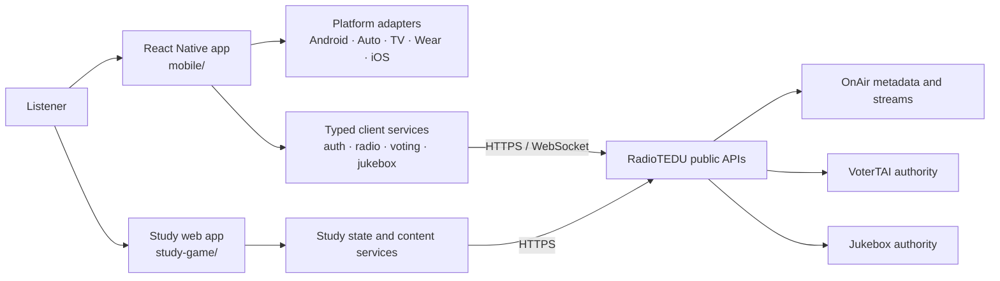

<p align="center">
  
</p>

<p align="center">
  
</p>

<h1 align="center">RTAI Mobile</h1>

<p align="center">
  The RadioTEDU companion app for live listening, Android Auto, Study, voting,
  and Jukebox controller experiences.
</p>

RTAI Mobile is a standalone React Native application with a separately built
Study web game. The app keeps its interactive experiences deliberately
separated: Study opens `radiotedu.com/study`, voting opens
`radiotedu.com/vote`, and the QR/controller Jukebox opens
`radiotedu.com/juke-local/controller`.

## What is included

| Component | Responsibility |
| --- | --- |
| `mobile/` | React Native application, native Android/iOS projects, and Android Auto integration |
| `study-game/` | Vite and Phaser Study experience, avatar tooling, tests, and production build |
| `scripts/` | Repository-level source and boundary verification |
| `tests/` | Contracts that keep this repository standalone and reproducible |
| `docs/` | API configuration, signing, release, and source-provenance guides |

The mobile app preserves the documented startup-branding contract in
[`mobile/README.md`](mobile/README.md): every cold launch shows the original
RadioTEDU and RTAI marks, and the black/red RTAI artwork is displayed on a
contrast card without recoloring.

## Experience map

```text
RTAI Mobile
├── Radio and station discovery
├── Android Auto playback controls
├── Study ─────────────── radiotedu.com/study
├── Voting ────────────── radiotedu.com/vote
└── Jukebox controller ── radiotedu.com/juke-local/controller
```

Study is developed and tested in `study-game/`, deployed to
`radiotedu.com/study`, and loaded remotely by the app. Study, voting, and
Jukebox controller website deployments therefore do not require an app release.

The phone package contains Android Auto. The iOS package contains the CarPlay
scene. Android TV and Wear OS use small native modules with the same
`com.radiotedumobile` Play listing/package and separate device-targeted bundles,
as required by Google Play.

## Requirements

- Node.js 20 with npm
- Java 17; CI uses Temurin
- Android SDK and Android Build Tools for local Android builds
- Xcode and CocoaPods for iOS development

The package manifests accept broader Node versions in places, but Node 20 is the
repository and CI baseline.

## Quick start

Clone the canonical repository:

```powershell
git clone https://github.com/radiotedu/rtai-mobile.git
Set-Location rtai-mobile
```

### Study

```powershell
Set-Location study-game
npm ci
npm test
npm run build
```

For browser development:

```powershell
npm run dev
```

Return to the repository root before continuing:

```powershell
Set-Location ..
```

### Mobile application

```powershell
Set-Location mobile
npm ci
npm test -- --runInBand
npx tsc --noEmit
npx eslint . --quiet
npm run audit:android
```

Start Metro and launch the desired target from separate terminals:

```powershell
npm start
npm run android
```

Use `npm run android:auto` for the Android Auto build variant. For iOS setup and
native dependency notes, follow [`mobile/README.md`](mobile/README.md).

## Verification

Run focused startup-branding tests from `mobile/`:

```powershell
npm test -- --runInBand __tests__/dualLogoSplashSource.test.ts __tests__/androidThemeSource.test.ts __tests__/App.test.tsx
```

Run repository-boundary checks from the repository root:

```powershell
node --test tests/repository-contract.test.mjs
node scripts/verify-repository.mjs
```

Build a local Android debug APK from `mobile/`:

```powershell
android/gradlew.bat assembleDebug
```

The checked-in Android debug keystore is development-only. It is not production
signing material. Production releases require the encrypted GitHub Actions
secrets documented in
[`docs/GITHUB_SECRETS.md`](docs/GITHUB_SECRETS.md); no production signing secret
is stored in this repository.

## Configuration and operations

- [API and WebView configuration](docs/API_CONFIGURATION.md)
- [Infrastructure hosts, mounts, and secret status](docs/INFRASTRUCTURE_CONFIGURATION.md)
- [GitHub signing secrets](docs/GITHUB_SECRETS.md)
- [Android release procedure](docs/RELEASE.md)
- [Source provenance and export scope](docs/SOURCE_PROVENANCE.md)
- [Detailed mobile architecture and development guide](mobile/README.md)

## Security boundaries

- Never commit Android production-signing credentials.
- Treat `.env` files, API credentials, and service tokens as local secrets.
- Keep remote WebView origins restricted to the documented RadioTEDU endpoints.
- Use the repository audit and contract checks before preparing a release.

## Technical architecture

RTAI Mobile is split into two independently buildable clients. `mobile/` is the
React Native application and owns navigation, device integration, localization,
and the radio/Jukebox/VoterTAI experiences. `study-game/` is a TypeScript web
application that can be developed and deployed without rebuilding the native
shell. Neither client is an authoritative playout system: commands and shared
state are validated by the corresponding RadioTEDU backend.



| Area | Responsibility | Important paths |
| --- | --- | --- |
| Native shell | Navigation, lifecycle, permissions, form-factor behavior | `mobile/App.tsx`, `mobile/src/`, `mobile/android/`, `mobile/ios/` |
| Study experience | Browser-based study game, content, and presentation | `study-game/src/`, `study-game/public/` |
| Contracts | Keeps client requests aligned with server-owned state | `mobile/src/`, `tests/` |
| Release checks | Linting, native audits, unit and end-to-end verification | `.github/`, `scripts/`, `tests/` |

The security boundary is deliberate: credentials belong in local environment
configuration, while playback, votes, and queue mutations remain server-owned.
