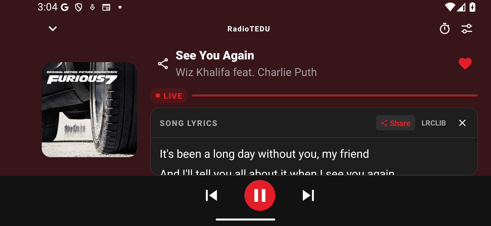

# Signed 7441ad1 candidate verification

September 13, 2026. Phone/tablet and local player checks passed. Automotive catalog paging failed, and external integration gates remain open. This candidate is not release-ready or approved for Google Play.

## Actual binary

- Source `7441ad1c052221363b75f9ff8855d7630addb8b2`, clean provenance embedded in the APK. [Signed build 34763532391](https://github.com/radiotedu/rtai-mobile/actions/runs/34763532391) and [CI 34763531159](https://github.com/radiotedu/rtai-mobile/actions/runs/34763531159) passed; CI includes iOS simulator compilation, not iOS runtime testing.
- Package `com.radiotedumobile`, version `1.3.9`, versionCode `13090`, actual target SDK `36`.
- APK SHA-256 `cdc2d88d04eb18df15c373011aa6227ac0dc75062eb7fdcbc57267627da2e27a`.
- AAB SHA-256 `974328a620be00a553d5c9d32a0520c39a712062445df4eabb94ea505af46b6f`.
- Established production certificate SHA-256 `b3b08db1c4aefbf4251d53951061ada727796479de45d817f9576232ff2d9439`.
- All 26 native libraries in APK and AAB pass 16 KB ELF alignment, including React Native, Hermes and FLAC. Actual APK packaging passes 16 KB zipalign.
- Actual manifest contains the car application declaration, `RadioTeduCarService` and `MediaLibraryService`. Inclusion does not prove Android Auto projection.
- Local artifacts and identity/native reports: `artifacts/release-v1.3.9-7441ad1/`. The Actions download archive digest was verified against GitHub before extraction.

## Player layout verified on this APK

Installed over the existing production-signed candidate using `adb install -r`, without wiping app data. Guest consent survived; authenticated-session preservation remains untested.

The landscape screenshot now shows the station, song title and artist, with artwork on the left and lyrics on the right. Portrait and landscape checks passed with normal and 1.3 system font scale, visible metadata, separate lyrics scrolling, 48 dp transport targets, and no artwork painted behind transport controls. Touch pause/resume passed with the app's own media session and active AudioFlinger track. Screenshot, recording and results: `output/device-744-controls-20260913-160344/`.

The [actual exported story PNG](images/release-1.3.9/744-player/now-playing-story.png) was saved through this APK's native share flow. It is a generated share card, not a simulated phone screenshot. WhatsApp/Instagram composer receipt remains untested.

The preceding 641 candidate's unexpected Voting transition was investigated separately: a 150-second run retained 49 media-session samples and passed initial/final rendered-audio checks. Evidence: `output/641-voting-endurance-20260913-155502/`. The interruption was not reproduced; this does not establish its cause or count as an endurance test of 744.

A separate 150-second Voting run on the exact 744 APK also passed: ten spaced checks required both its playing media session and active app AudioFlinger track; final artwork and touch pause passed. Evidence: `output/744-voting-endurance-20260913-161614/`. Sampling does not prove the absence of every brief interruption between samples.

## Remaining runtime verification

Driver commit `e7391ed5bb67d8823d07628ea65a885d36e766b1` pins this build, source and APK digest in both jobs. [Phone/tablet 34764517623](https://github.com/radiotedu/rtai-mobile/actions/runs/34764517623) passed guest startup/restarts, tab navigation, enlarged text, orientation, rendered radio audio, background pause/resume, offline recovery and actual story/square PNG exports. No app entry appeared in the Android crash buffer. The tablet encountered a Pixel Launcher ANR before app setup; the test closed the hung launcher and retained that environment incident. The exported phone story and tablet landscape player were visually reviewed. These are guest checks, not authenticated account tests.

Local all-nine-station checks passed: selected station identity, active app AudioFlinger audio at startup and after eight seconds, touch pause, and nonuniform artwork. English and French screenshots now visibly show the official bundled AI station artwork; Lo-Fi remains present. English Social wording and its guest login gate passed. Evidence and per-station recordings: `output/744-stations-social-20260913-160614/`. This resolves the previously reproduced blank artwork on this test sequence; it is not a continuous-stream uptime claim.

The exact APK's Profile → Data & Privacy → account-deletion website link passed. The browser showed the expected public URL and deletion instructions. No deletion request, email action or form submission occurred. Evidence: `output/744-deletion-link-20260913-161228/`.

[Automotive 34764519457](https://github.com/radiotedu/rtai-mobile/actions/runs/34764519457) failed its visible catalog assertion: English, French, Rock and Voting were not collected during paging. Runtime stream checks reported 9/9 active and host accessibility scroll events reported `ItemCount: 9`; retained screenshots and recording show the host returning to earlier rows. Therefore this is not proof that those stations were removed or unavailable. The paging failure remains unresolved; no successful car playback, podcast or reconnect claim is made for this run. Evidence: `output/cloud-car-34764519457/`, including original recording, catalog screenshots and logs. It must be reproduced on a supported car test setup before public release; the assertion was not weakened or replaced by an HTTP/catalog-count check.

The 744 changes add bounded image decoding and error diagnostics, share in-flight stream probes, coalesce phone refreshes and retry connection failures once. HTTP failures and non-audio responses still fail immediately. Source checks passed: 413 mobile tests in 103 suites, TypeScript, release-version validation, Android audit and changed-file lint with zero errors and existing warnings.

All 19 terminal files (22 ZIP entries including directories) exactly match the previously tested b630 package. Terminal TGZ SHA-256 remains `175e6cbff5f3b8600708098e0bbb98fa9076ac79ddce20cbeacc835b6dc3fafd`; terminal ZIP SHA-256 is `ee5e9d510fcb980ff787989d367e4c301d4a880e26e6a5509dae52435190a9ef`. Existing terminal tests and nine-stream decoded-audio evidence apply to these identical contents.

All 22 retained 744 recordings decoded successfully with ffmpeg using normalized output timestamps. Originals are preserved. This validates frame decoding, not original timing or frame-by-frame visual correctness. Source-suffixed APK, AAB and terminal files were uploaded to the existing private GitHub draft as `akgularda`; returned asset SHA-256 digests match local files. Old assets remain preserved. The draft evidence archive includes successful checks and the failed Automotive run with their original result labels.

Full Android Auto projection, isolated authenticated registration/account/Gold/game tests and receipt in WhatsApp/Instagram remain blocked by the [device/environment prerequisites](RELEASE_1_3_9_DEVICE_TEST_HANDOFF.md). The server-owned Jukebox locale/branding defect needs the [web-server handoff](JUKE_CONTROLLER_LOCALE_SERVER_HANDOFF.md). No production user data, stream infrastructure, reward rules or signing keys were changed. No public release or Play submission has occurred.
