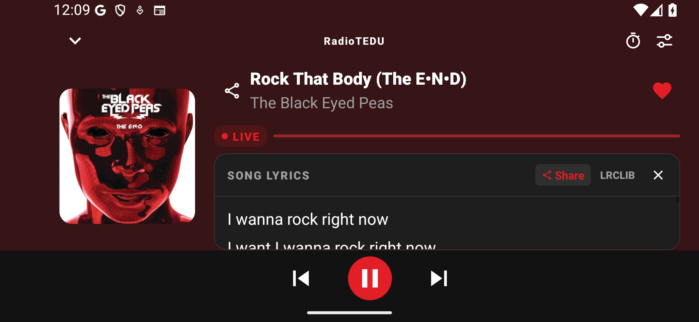
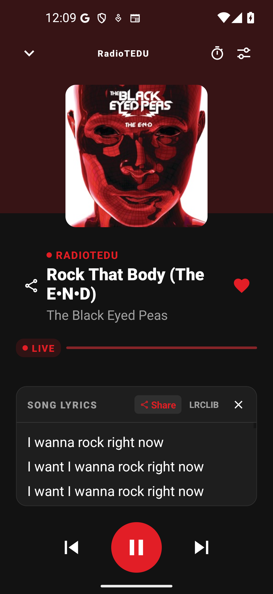

# Player layout correction after visual review

September 13, 2026. The user identified two unacceptable e32 candidate layouts: a portrait lyrics card with its bottom edge hidden, and landscape artwork with song/artist metadata outside the viewport. Earlier transport checks were too narrow to certify the complete player.

Source changes:

- Portrait: keep the complete lyrics card outside the artwork/metadata scroll area, directly above transport controls; reserve more space for it by reducing artwork size while lyrics are open. Lyrics scroll inside their own card.
- Landscape: display artwork alongside a details column containing the song, artist and lyrics. The station remains visible in the header. Smaller transport controls retain 56dp play and 56dp side-button targets while freeing vertical space.
- Remove the redundant `RadioTEDU · RadioTEDU` header prefix.
- Extend device checks to require nonempty station/song/artist nodes in the visible area above controls. If lyrics are present, require a card tall enough for its header and a text line, entirely above controls and outside any scrolling ancestor. Absence of lyrics is explicitly recorded and cannot establish a lyrics-layout pass.

Local source validation: 409 tests in 103 suites passed; TypeScript passed; lint completed with 0 errors and 227 retained warnings; v1.3.9 release-version validation and 36/36 Android source checks passed. No native build ran locally. Production-signed build and actual phone/tablet/orientation screenshots must verify this correction before it is described as fixed on-device.

Do not treat the current e32 APK or its passing transport-only tests as proof of these new visual corrections. Full Android Auto projection, isolated account/Gold flows and remaining release gates are unchanged.

## Signed c9 candidate: local device verification

Build [34755606689](https://github.com/radiotedu/rtai-mobile/actions/runs/34755606689) succeeded from clean source `c9ef48b03c747c4469746f62c20bef0f91341b05`. Actual APK identity is `com.radiotedumobile`, version `1.3.9`, versionCode `13090`, production certificate SHA-256 `b3b08db1c4aefbf4251d53951061ada727796479de45d817f9576232ff2d9439`.

- APK SHA-256: `48fc0dd498a9074f1731cc3c20ad27e2c46f76303e018d3fcd6ea078a55337f6`.
- AAB SHA-256: `1e4c0cac0c6eb6d39d4e8fca20fd646aad9433930c44d1774acdb93bc719ddef`.
- Both artifacts passed 16 KB ELF verification for all 26 packaged 64-bit libraries, including React Native, Hermes and FLAC. APK packaging alignment passed zipalign.
- Installed over the previous production-signed e32 APK with `adb install -r`; retained existing guest consent. Authenticated data preservation remains untested.
- Local emulator checks passed real AudioFlinger playback, touch pause/resume, portrait/landscape and text scale 1.0/1.3. Station, title and artist remain visible; lyrics load over Wi-Fi and their complete card stays above transport controls. Lyrics scroll inside the card.
- Visually inspected both captured layouts below, including the lyrics card's rounded bottom edge. Full screen recording retained in local evidence; no claim of frame-by-frame review.

[Local device assertions](images/release-1.3.9/player-c9ef48b/result.json). Cloud phone/tablet/Automotive checks and exact-source iOS CI are pending at this checkpoint. Full Android Auto projection and isolated authenticated Gold checks remain unresolved; this is not a release-ready declaration.
