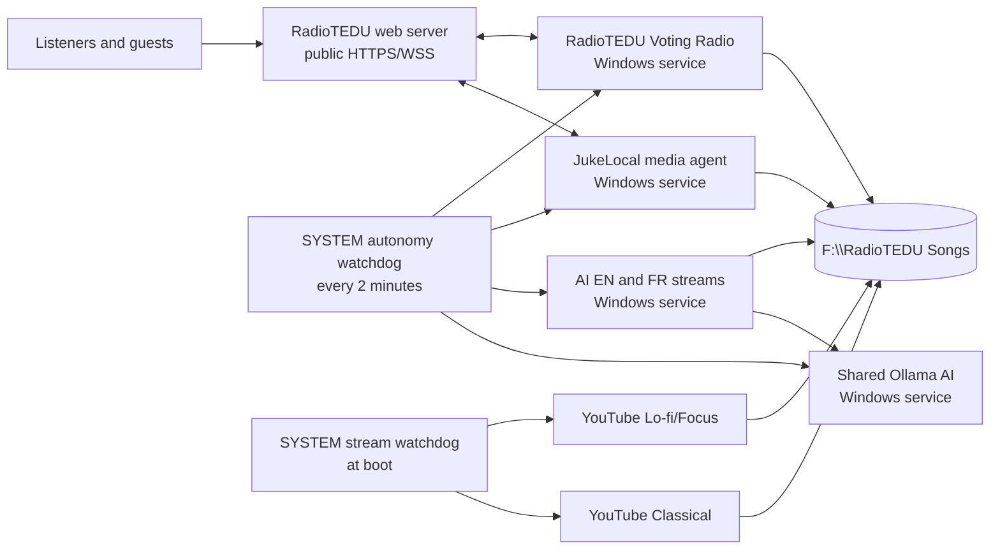

# RadioTEDU services-PC operations

This directory documents the production services PC without changing any public API. It is the human-readable entry point for Voting, JukeLocal, AI radio, shared AI, and the two YouTube streams.

## Architecture

## Component map

| Function | Production supervisor | Human music location | Refresh behavior | Source repository |
|---|---|---|---|---|
| Genre Voting | `RadioTEDUVotingRadio` Windows service | `F:\RadioTEDU Songs\Voting` | Background scan every 10 seconds | [radiotedu/votertai](https://github.com/radiotedu/votertai) |
| JukeLocal | `RadioTEDU.JukeLocalMediaAgent` Windows service | `F:\RadioTEDU Songs` | Watcher plus background scan every 10 seconds | [akgularda/juke-local](https://github.com/akgularda/juke-local) |
| AI English | `RadioTEDU.AIStreams` Windows service | `F:\RadioTEDU Songs\AI\rights-cleared\radiotedu-en` | Restart AI Streams after an approved batch update | [akgularda/RadioTEDU](https://github.com/akgularda/RadioTEDU) |
| AI French | `RadioTEDU.AIStreams` Windows service | `F:\RadioTEDU Songs\AI\rights-cleared\radiotedu-fr` | Restart AI Streams after an approved batch update | [akgularda/RadioTEDU](https://github.com/akgularda/RadioTEDU) |
| Shared AI | `RadioTEDU.SharedAI` Windows service | No music folder | Automatic | [akgularda/RadioTEDU](https://github.com/akgularda/RadioTEDU) |
| YouTube Focus/Lo-fi | `RadioTEDU YouTube Focus Stream V4` SYSTEM boot task | `F:\RadioTEDU Songs\Juke Local\All PC Songs\Legacy Libraries\RadioTEDU-LoFi-Library\tracks` | Rescans before each track | [akgularda/radiotedu-focus-stream](https://github.com/akgularda/radiotedu-focus-stream) |
| YouTube Classical | `RadioTEDU YouTube Classical Stream` SYSTEM boot task | `F:\RadioTEDU Songs\Juke Local\All PC Songs\Legacy Libraries\RadioTEDU-Classical-Library\tracks` | Rescans before each track | [akgularda/radiotedu-focus-stream](https://github.com/akgularda/radiotedu-focus-stream) |

## Safe human update procedure

1. Confirm the audio is licensed or approved for the intended channel.
2. Copy the file into the exact folder in the table. Keep one song per file and use meaningful artist/title metadata.
3. Voting and JukeLocal discover changes automatically within about 10 seconds. YouTube discovers them before selecting its next track.
4. For AI English/French, run an elevated PowerShell and execute `Restart-Service RadioTEDU.AIStreams` after the batch copy.
5. Run `docs/services-pc/Verify-RadioTEDU-Services.ps1` from an elevated or ordinary PowerShell. It is read-only.
6. For a JukeLocal functional check, use the public controller as a guest, enter device code `KOLEJ`, search, press Enter, and queue one approved song. Do not use an administrator account for guest acceptance.

Supported formats:

- Voting: AAC, AIF/AIFF, ALAC, FLAC, M4A, MP3, OGG, OPUS, WAV, WEBM and WMA.
- AI: AAC, APE, FLAC, M4A, MP3, OGG, OPUS, WAV and WEBM.
- YouTube: AAC, FLAC, M4A, MP3, OGA/OGG, OPUS and WAV.
- JukeLocal: use ordinary playable audio formats; MP3, FLAC, M4A, OGG, OPUS and WAV are the safest choices.

## Durability model

The four application services run as `LocalSystem`, use immediate Automatic startup, and have Windows Service Control Manager restart actions at 5, 15 and 30 seconds. Their service host also relaunches a failed child process after 5 seconds.

Two independent SYSTEM tasks provide a second recovery layer:

- `RadioTEDU-Autonomous-Start` runs at boot.
- `RadioTEDU-Autonomous-Watchdog` checks semantic health every two minutes and restarts only the failed component.

YouTube runs under SYSTEM boot tasks with task-level restart settings. `RadioTEDU Stream Watchdog` independently detects and relaunches a missing Lo-fi or Classical supervisor.

## Secrets and APIs

- No secret, token, credential value, production `.env`, media file, log, PID file or queue record belongs in Git.
- Secrets remain under the protected ProgramData stores on the services PC.
- Public endpoint paths and payload contracts are intentionally unchanged.
- Rotate any credential exposed through chat or another unapproved channel on both endpoints before treating it as confidential again.

## Versioned operational source

`ops/services-pc` contains the non-secret Windows service host, recovery installer, watchdog/verifier scripts and service definitions used to understand and reproduce the operational layer. Machine-specific credentials are deliberately excluded.

